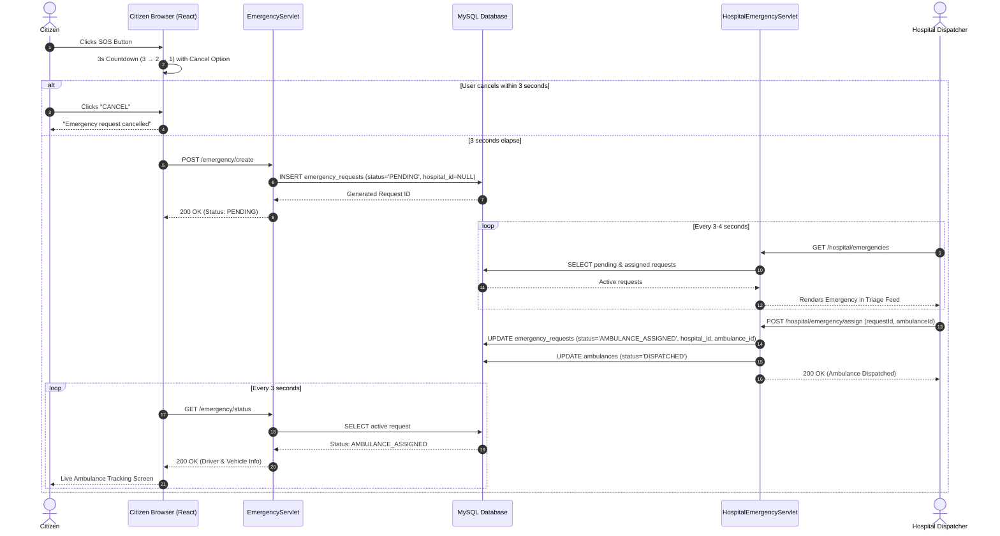

# PulseRoute 2.0 — Emergency Response Coordination System

[](https://www.oracle.com/java/)
[](https://tomcat.apache.org/)
[](https://tomcat.apache.org/)
[](https://www.mysql.com/)
[](https://react.dev/)
[](https://tailwindcss.com/)

**PulseRoute 2.0** is an enterprise-grade, real-time emergency triage and ambulance dispatch coordination platform designed to bridge the life-saving gap between citizens in distress and regional hospital emergency trauma centers.

---

## 📑 Table of Contents

- [Architectural Overview](#-architectural-overview)
- [Key Features](#-key-features)
  - [1. Citizen Emergency Portal](#1-citizen-emergency-portal)
  - [2. Hospital Admin Command Center](#2-hospital-admin-command-center)
  - [3. Backend & Security Architecture](#3-backend--security-architecture)
  - [4. Database & Relational Modeling](#4-database--relational-modeling)
- [System Workflow & Lifecycle](#-system-workflow--lifecycle)
- [Technology Stack](#️-technology-stack)
- [Project Directory Structure](#-project-directory-structure)
- [Installation & Local Setup](#-installation--local-setup)
  - [Prerequisites](#prerequisites)
  - [Database Setup](#1-database-setup)
  - [Build & Packaging](#2-build--packaging)
  - [Tomcat Deployment](#3-tomcat-deployment)
- [Demo Credentials](#-demo-credentials)
- [API Reference](#-api-reference)
- [Design System & UI Guidelines](#-design-system--ui-guidelines)
- [License](#-license)

---

## 🏛 Architectural Overview

```
 ┌──────────────────────────┐             ┌──────────────────────────┐
 │   Citizen SOS Portal     │             │ Hospital Command Center  │
 │  (React 18 / Tailwind)   │             │   (Live Incident Feed)   │
 └────────────┬─────────────┘             └────────────┬─────────────┘
              │                                        │
              ▼                                        ▼
 ┌───────────────────────────────────────────────────────────────────┐
 │                     Security & Access Control                     │
 │      (AuthFilter: Role Authorization & SOS Public Access)         │
 └────────────────────────────┬──────────────────────────────────────┘
                              │
              ┌───────────────┴───────────────┐
              ▼                               ▼
 ┌─────────────────────────┐     ┌─────────────────────────┐
 │ EmergencyServlet        │     │ HospitalEmergencyServlet│
 │ - SOS Creation (3s wait)│     │ - Live Emergency Triage │
 │ - Status Polling        │     │ - Ambulance Dispatch    │
 │ - Request Cancellation  │     │ - Fleet Status Control  │
 └────────────┬────────────┘     └────────────┬────────────┘
              │                               │
              └───────────────┬───────────────┘
                              ▼
 ┌───────────────────────────────────────────────────────────────────┐
 │          Data Access Layer (DAOs: Emergency, Ambulance, Hospital) │
 └────────────────────────────┬──────────────────────────────────────┘
                              ▼
 ┌───────────────────────────────────────────────────────────────────┐
 │                   MySQL 8.4 Relational Database                   │
 │       (pulseroute: users, hospitals, ambulances, requests)        │
 └───────────────────────────────────────────────────────────────────┘
```

---

## ✨ Key Features

### 1. Citizen Emergency Portal (`index.html`)

* **3-Second Confirmation & Cancel Safety Window:**
  * When SOS is triggered, a modal countdown displays (**3 → 2 → 1**) before the call is sent.
  * Allows users to immediately hit **CANCEL** if triggered accidentally, avoiding false alarms.
* **Instant GPS Location Broadcast:**
  * Auto-detects device GPS coordinates with live reverse-geocoded location previews.
* **Live Emergency Tracking & Telemetry:**
  * Real-time status sync: `PENDING` ➔ `APPROVED` ➔ `AMBULANCE_ASSIGNED` ➔ `DISPATCHED` ➔ `COMPLETED`.
  * Displays assigned ambulance registration number, hospital name, and direct driver contact card.
* **Interactive First-Aid & Audio CPR Guide:**
  * Web Audio API rhythmic metronome pulsing at 100 BPM to guide chest compressions.
  * Multi-lingual voice assistance in English, Hindi (हिंदी), Marathi (मराठी), and Tamil (தமிழ்).
* **Women Safety Mode & Media Triage:**
  * Live camera/audio recorder to capture scene surroundings for trauma staff.

### 2. Hospital Admin Command Center (`hospital-dashboard.html`)

* **Unified Light Theme Interface:**
  * Modern, high-contrast, clean slate & emerald aesthetic matching the citizen portal.
* **Live Emergency Feed:**
  * Auto-polls incoming emergencies with urgency badges (`CRITICAL`, `URGENT`, `STABLE`).
  * Broadcasts unassigned requests across regional hospitals until claimed.
* **One-Click Ambulance Fleet Dispatch:**
  * Dropdown selector displaying only active, available vehicles.
  * Instantly stamps ambulance ID, updates driver status, and alerts the citizen in real-time.
* **Hospital Fleet Management:**
  * Toggle vehicle states between `AVAILABLE`, `DISPATCHED`, and `OFFLINE`.

### 3. Backend & Security Architecture

* **Role-Based Access Control (`AuthFilter`):**
  * Hospital command centers are strictly gated by session-verified hospital credentials.
  * Public access granted to `/emergency/*` so that life-saving emergency dispatches are never rejected due to missing login sessions.
* **Secure Authentication:**
  * BCrypt password hashing for citizen accounts and hospital administrator passwords.
* **Resilient Session Fallbacks:**
  * Safe guest emergency profile tracking ensures citizen requests are never lost on transient network reconnections.

### 4. Database & Relational Modeling

* Structured relational schema with foreign key constraints, indexing on request statuses, and automated timestamps.

---

## 🔄 System Workflow & Lifecycle



---

## 🛠️ Technology Stack

| Layer | Technologies |
|---|---|
| **Frontend** | HTML5, React 18 (Standalone/Babel), Tailwind CSS, Vanilla CSS Animations, Web Audio API |
| **Backend** | Java 21+ / JDK 26, Jakarta Servlet 6.0, Apache Tomcat 11 |
| **Database** | MySQL Server 8.4 (InnoDB, Relational SQL) |
| **Security** | BCrypt password hashing, Jakarta WebFilter (`AuthFilter`), Session Cookies |
| **Build & Deploy** | Apache Maven (`pom.xml`), Windows Batch (`build.bat`, `run-tomcat.bat`) |

---

## 📁 Project Directory Structure

```
PulseRoute/
├── src/
│   ├── main/
│   │   ├── java/com/pulseroute/
│   │   │   ├── dao/                 # Data Access Objects
│   │   │   │   ├── AmbulanceDAO.java
│   │   │   │   ├── EmergencyRequestDAO.java
│   │   │   │   ├── HospitalDAO.java
│   │   │   │   └── UserDAO.java
│   │   │   ├── filter/              # Access Control & Security
│   │   │   │   └── AuthFilter.java
│   │   │   ├── model/               # Business Entities
│   │   │   │   ├── Ambulance.java
│   │   │   │   ├── EmergencyRequest.java
│   │   │   │   ├── Hospital.java
│   │   │   │   └── User.java
│   │   │   ├── servlet/             # Jakarta HTTP Controllers
│   │   │   │   ├── EmergencyServlet.java
│   │   │   │   ├── HospitalAmbulanceServlet.java
│   │   │   │   ├── HospitalEmergencyServlet.java
│   │   │   │   ├── HospitalLoginServlet.java
│   │   │   │   ├── HospitalLogoutServlet.java
│   │   │   │   ├── HospitalSessionServlet.java
│   │   │   │   ├── LoginServlet.java
│   │   │   │   ├── LogoutServlet.java
│   │   │   │   └── SignupServlet.java
│   │   │   └── util/                # Database & Security Utilities
│   │   │       ├── BCrypt.java
│   │   │       └── DBConnection.java
│   │   ├── resources/
│   │   │   └── db.properties        # Database Configuration
│   │   └── webapp/
│   │       ├── WEB-INF/
│   │       │   ├── lib/             # mysql-connector-j-8.4.0.jar
│   │       │   └── web.xml          # Deployment Descriptor
│   │       ├── hospital-dashboard.html # Hospital Command Center
│   │       ├── hospital-login.html     # Hospital Admin Sign-in
│   │       ├── index.html              # Citizen SOS Portal
│   │       └── index.css               # Design System Stylesheet
├── schema.sql                       # Citizen database DDL
├── hospital_schema.sql              # Hospital, Ambulance & Emergency DDL + Seed Data
├── build.bat                        # Automated compilation & WAR deployer
├── run-tomcat.bat                   # Development server launcher
├── pom.xml                          # Maven build definition
├── .gitignore                       # Repository ignore rules
└── README.md                        # Documentation
```

---

## 🚦 Installation & Local Setup

### Prerequisites

* **JDK 21 or JDK 26** installed and added to `PATH`
* **Apache Tomcat 11.0+**
* **MySQL Server 8.0+ / 8.4** running on `localhost:3306`

### 1. Database Setup

1. Start your local MySQL server.
2. Initialize the database and tables using the provided schemas:
   ```bash
   mysql -u root -p < schema.sql
   mysql -u root -p pulseroute < hospital_schema.sql
   ```

### 2. Build & Packaging

You can build using the automated build script:
```bash
# Windows
.\build.bat
```
Or via Maven:
```bash
mvn clean package
```
This produces `pulseroute.war`.

### 3. Tomcat Deployment

1. Copy `pulseroute.war` to your Tomcat `webapps/` folder:
   ```bash
   copy pulseroute.war C:\apache-tomcat-11.0.4\webapps\
   ```
2. Start Apache Tomcat:
   ```bash
   .\run-tomcat.bat
   ```
3. Access the portals:
   * **Citizen Emergency Portal:** `http://localhost:8080/pulseroute/index.html`
   * **Hospital Admin Login:** `http://localhost:8080/pulseroute/hospital-login.html`

---

## 🔑 Demo Credentials

### Hospital Command Center Credentials

| Hospital Code | Hospital Name | Location | Password |
|---|---|---|---|
| `HOSP-01` | Lilavati Hospital & Research Centre | Bandra West, Mumbai | `Admin@123` |
| `HOSP-02` | KEM Hospital | Parel, Mumbai | `Admin@123` |
| `HOSP-03` | Nanavati Max Super Speciality Hospital | Vile Parle, Mumbai | `Admin@123` |

*(Quick-fill buttons are available on the Hospital Login page for rapid evaluation.)*

---

## 🔌 API Reference

### Citizen Endpoints

| Method | Endpoint | Description |
|---|---|---|
| `POST` | `/pulseroute/emergency/create` | Creates a new emergency SOS request. |
| `GET` | `/pulseroute/emergency/status` | Polls live status of the active emergency for the caller. |
| `POST` | `/pulseroute/emergency/cancel` | Cancels an ongoing emergency request. |
| `POST` | `/pulseroute/login` | Citizen user login. |
| `POST` | `/pulseroute/signup` | Citizen user registration. |

### Hospital Endpoints

| Method | Endpoint | Description |
|---|---|---|
| `POST` | `/pulseroute/hospital/login` | Authenticates hospital administrator. |
| `GET` | `/pulseroute/hospital/emergencies` | Retrieves live emergency triage feed. |
| `POST` | `/pulseroute/hospital/emergency/approve` | Acknowledges and claims incoming emergency. |
| `POST` | `/pulseroute/hospital/emergency/assign` | Dispatches an ambulance to a specific request. |
| `GET` | `/pulseroute/hospital/ambulances` | Retrieves hospital ambulance fleet and availability. |
| `POST` | `/pulseroute/hospital/ambulance/status` | Toggles ambulance operational status (`AVAILABLE`/`OFFLINE`). |

---

## 🎨 Design System & UI Guidelines

* **Color Palette:**
  * **Brand Accent:** `#E85D24` (Pulse Orange)
  * **Surface / Background:** `#F8FAFC` to `#FFFFFF` (Clean, sterile light theme)
  * **Status Badges:** Emerald (`#22C55E`), Amber (`#F59E0B`), Rose/Danger (`#EF4444`)
* **Typography:** Modern grotesque sans-serif (`Inter`, `sans-serif`) via Google Fonts.
* **Micro-Interactions:** Subtle scale transitions, active ring pulse states for incoming alarms, and accessible contrast ratios.

---

## 📄 License

This project is licensed under the MIT License — feel free to adapt, extend, and deploy for municipal and institutional emergency management.
