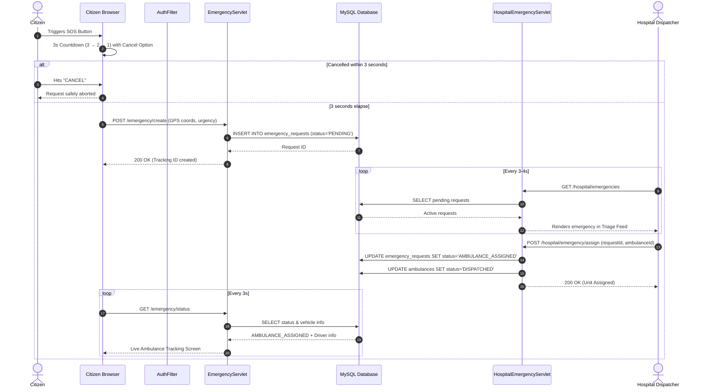

# PulseRoute 2.0 — Smart Emergency Healthcare Coordination Platform

[](https://www.oracle.com/java/)
[](https://tomcat.apache.org/)
[](https://tomcat.apache.org/)
[](https://www.mysql.com/)
[](https://www.docker.com/)
[](https://tailwindcss.com/)

**PulseRoute 2.0** is an enterprise-grade, real-time emergency healthcare coordination and ambulance dispatch platform. It bridges the critical time gap between citizens in life-threatening distress and regional trauma centers through low-latency telemetry, automated nearest-responder routing, and smart fleet management.

---

## 📑 Table of Contents

- [Architectural Overview](#-architectural-overview)
- [Key Features](#-key-features)
  - [1. Public Healthcare Landing Page](#1-public-healthcare-landing-page)
  - [2. Citizen Emergency Application](#2-citizen-emergency-application)
  - [3. Unified Citizen Auth Portal](#3-unified-citizen-auth-portal)
  - [4. Hospital Command Center](#4-hospital-command-center)
  - [5. Backend Security & Access Control](#5-backend-security--access-control)
- [System Workflow & Sequence](#-system-workflow--sequence)
- [Technology Stack](#️-technology-stack)
- [Project Directory Structure](#-project-directory-structure)
- [Quick Demo Credentials](#-quick-demo-credentials)
- [Installation & Local Setup](#-installation--local-setup)
- [Production Deployment Guide](#-production-deployment-guide)
  - [Option A: One-Click Cloud Deployment (Railway / Render)](#option-a-one-click-cloud-deployment-railway--render)
  - [Option B: Linux VPS with Docker Compose (AWS / DigitalOcean)](#option-b-linux-vps-with-docker-compose)
  - [Option C: Instant Live URL (Cloudflare Tunnel / ngrok)](#option-c-instant-live-url-for-demos)
- [API Reference](#-api-reference)
- [License](#-license)

---

## 🏛 Architectural Overview

```
 ┌────────────────────────────────────────────────────────────────────────┐
 │                      Public Internet / DNS / SSL                       │
 └───────────────────────────────────┬────────────────────────────────────┘
                                     │
                 ┌───────────────────┴───────────────────┐
                 ▼                                       ▼
    ┌─────────────────────────┐             ┌─────────────────────────┐
    │   Public Landing Page   │             │   Hospital Staff Login  │
    │      (index.html)       │             │  (hospital-login.html)  │
    └────────────┬────────────┘             └────────────┬────────────┘
                 │ (Get Started / Login)                 │ (Staff Auth)
                 ▼                                       ▼
    ┌─────────────────────────┐             ┌─────────────────────────┐
    │  Citizen Authentication │             │ Hospital Command Center │
    │       (login.html)      │             │(hospital-dashboard.html)│
    └────────────┬────────────┘             └────────────┬────────────┘
                 │ (Authenticated Session)               │
                 ▼                                       │
    ┌─────────────────────────┐                          │
    │   Protected SOS App     │                          │
    │     (dashboard.html)    │                          │
    └────────────┬────────────┘                          │
                 │                                       │
                 ▼                                       ▼
  ┌─────────────────────────────────────────────────────────────────────┐
  │                 Jakarta AuthFilter (Session Guard)                  │
  │     - Protects /dashboard.html & /hospital-dashboard.html           │
  │     - Keeps public endpoints (/emergency/*, assets) accessible      │
  └──────────────────────────────────┬──────────────────────────────────┘
                                     │
                 ┌───────────────────┴───────────────────┐
                 ▼                                       ▼
    ┌─────────────────────────┐             ┌─────────────────────────┐
    │    EmergencyServlet     │             │HospitalEmergencyServlet │
    │   - 3-Sec SOS Dispatch  │             │  - Live Incident Triage │
    │   - Real-time Telemetry │             │  - Fleet Assignment     │
    │   - Request Cancel      │             │  - Unit Availability    │
    └────────────┬────────────┘             └────────────┬────────────┘
                 │                                       │
                 └───────────────────┬───────────────────┘
                                     ▼
  ┌─────────────────────────────────────────────────────────────────────┐
  │       Data Access Layer (DAOs: User, Hospital, Ambulance, Request)  │
  └──────────────────────────────────┬──────────────────────────────────┘
                                     ▼
  ┌─────────────────────────────────────────────────────────────────────┐
  │                    MySQL 8.4 Relational Database                    │
  │       (Tables: users, hospitals, ambulances, emergency_requests)    │
  └─────────────────────────────────────────────────────────────────────┘
```

---

## ✨ Key Features

### 1. Public Healthcare Landing Page (`index.html`)
* **11 Immersive Sections:** Hero with live interactive radar demo, How It Works, Features grid, Emergency Services, 5-stage Network Architecture Flow, Trust & Security stats, and FAQ accordion.
* **Instant Emergency Shortcut:** Direct header emergency trigger modal allowing instant SOS initiation.
* **Responsive Navigation:** Clean desktop layout and mobile drawer menu with zero clutter.

### 2. Citizen Emergency Application (`dashboard.html`)
* **3-Second Confirmation & Cancel Safety Window:**
  * When SOS is pressed, a countdown (**3 → 2 → 1**) prevents false alarms and allows instant cancellation.
* **Live GPS Geolocation Broadcast:**
  * Auto-detects device coordinates with reverse-geocoded location previews.
* **Real-time Telemetry & Unit Tracking:**
  * Status cycles dynamically: `PENDING` ➔ `APPROVED` ➔ `AMBULANCE_ASSIGNED` ➔ `DISPATCHED` ➔ `COMPLETED`.
  * Displays assigned vehicle registration number, driver details, and contact card.
* **Audio CPR Metronome & First Aid:**
  * Built-in Web Audio API rhythmic pulse beating at 100 BPM to assist chest compressions during cardiac emergencies.
  * Multi-lingual voice assistance in English, Hindi, Marathi, and Tamil.

### 3. Unified Citizen Auth Portal (`login.html`)
* **Citizen Sign-In, Registration, and Password Recovery:**
  * Gated protected dashboard routing (`AuthFilter` redirects unauthorized visitors to `/login.html?error=unauthorized`).
* **One-Click Demo Fill:**
  * Instant pre-fill credentials for fast evaluation and testing.

### 4. Hospital Command Center (`hospital-dashboard.html`)
* **Live Incident Feed:**
  * Polls incoming emergencies in real time with visual urgency tags (`CRITICAL`, `URGENT`, `STABLE`).
* **Fleet Assignment Engine:**
  * Dynamic unit dropdown displaying active, available vehicles under the hospital's command.
  * Automatic unit status management (`AVAILABLE` ➔ `DISPATCHED` ➔ `OFFLINE`).

### 5. Backend Security & Access Control
* **Jakarta `AuthFilter`:**
  * Citizen session verification for `/dashboard.html` and hospital session verification for `/hospital-dashboard.html`.
* **Safe Guest Emergency Path:**
  * `/emergency/*` API remains public so that urgent life-saving dispatch requests are never delayed by lost sessions.
* **BCrypt Password Hashing:**
  * All credentials are encrypted using industry-standard BCrypt rounds.

---

## 🔄 System Workflow & Sequence


```mermaid
sequenceDiagram
    autonumber
    actor Citizen
    participant Client as Citizen Browser
    participant Filter as AuthFilter
    participant Servlet as EmergencyServlet
    participant DB as MySQL Database
    participant HospServlet as HospitalEmergencyServlet
    actor Dispatcher as Hospital Dispatcher

    Citizen->>Client: Triggers SOS Button
    Client->>Client: 3s Countdown (3 → 2 → 1) with Cancel Option
    alt Cancelled within 3 seconds
        Citizen->>Client: Hits "CANCEL"
        Client-->>Citizen: Request safely aborted
    else 3 seconds elapse
        Client->>Servlet: POST /emergency/create (GPS coords, urgency)
        Servlet->>DB: INSERT INTO emergency_requests (status='PENDING')
        DB-->>Servlet: Request ID
        Servlet-->>Client: 200 OK (Tracking ID created)
        
        loop Every 3-4s
            Dispatcher->>HospServlet: GET /hospital/emergencies
            HospServlet->>DB: SELECT pending requests
            DB-->>HospServlet: Active requests
            HospServlet-->>Dispatcher: Renders emergency in Triage Feed
        end

        Dispatcher->>HospServlet: POST /hospital/emergency/assign (requestId, ambulanceId)
        HospServlet->>DB: UPDATE emergency_requests SET status='AMBULANCE_ASSIGNED'
        HospServlet->>DB: UPDATE ambulances SET status='DISPATCHED'
        HospServlet-->>Dispatcher: 200 OK (Unit Assigned)

        loop Every 3s
            Client->>Servlet: GET /emergency/status
            Servlet->>DB: SELECT status & vehicle info
            DB-->>Servlet: AMBULANCE_ASSIGNED + Driver info
            Servlet-->>Client: Live Ambulance Tracking Screen
        end
    end
```

---

## 🛠️ Technology Stack

| Component | Technology | Description |
|---|---|---|
| **Frontend** | HTML5, React 18, Tailwind CSS, Lucide Icons | Responsive UI, live status polling, Web Audio API |
| **Backend** | Java 21+ / OpenJDK 26, Jakarta Servlet 6.0 | Thread-safe controllers, filter pipelines |
| **Web Server** | Apache Tomcat 11.0.4 | Jakarta EE 10 compliant servlet container |
| **Database** | MySQL Server 8.4 | InnoDB relational engine with foreign key constraints |
| **Security** | Jakarta `WebFilter`, BCrypt, Session Guard | Role-based authentication and route protection |
| **Deployment** | Docker, Docker Compose, Maven 3.9 | Multi-stage containerization, cloud ready |

---

## 📁 Project Directory Structure

```
PulseRoute/
├── src/
│   ├── main/
│   │   ├── java/com/pulseroute/
│   │   │   ├── dao/                 # Data Access Objects (User, Hospital, Ambulance, Request)
│   │   │   ├── filter/              # AuthFilter.java (Route & Session Guard)
│   │   │   ├── model/               # Java Entity Beans
│   │   │   ├── servlet/             # Jakarta Servlet HTTP Controllers
│   │   │   └── util/                # BCrypt.java & DBConnection.java (Env Var Support)
│   │   ├── resources/
│   │   │   └── db.properties        # Database config fallback
│   │   └── webapp/
│   │       ├── WEB-INF/
│   │       │   ├── lib/             # mysql-connector-j-8.4.0.jar
│   │       │   └── web.xml          # Servlet mapping and deployment descriptor
│   │       ├── css/index.css        # Core stylesheet
│   │       ├── index.html           # Public Healthcare Landing Page
│   │       ├── dashboard.html       # Protected Citizen Emergency App
│   │       ├── login.html           # Citizen Authentication (Login, Register, Recover)
│   │       ├── hospital-login.html  # Hospital Staff Sign-in
│   │       └── hospital-dashboard.html # Hospital Emergency Command Center
├── Dockerfile                       # Multi-stage production container build (Maven + Tomcat 11)
├── docker-compose.yml               # One-command full-stack containerization (App + MySQL 8.4)
├── hospital_schema.sql              # Database DDL & seeded hospitals/ambulances
├── schema.sql                       # Core user table definition
├── build.bat                        # Local Windows compilation & deployment script
├── run-tomcat.bat                   # Local development server launcher
├── pom.xml                          # Maven build specification
└── README.md                        # Documentation
```

---

## 🔑 Quick Demo Credentials

### Citizen Accounts (for `/login.html`)
| Citizen ID / Email | Password | Role |
|---|---|---|
| `CIT-9012` / `aarav.sharma@example.com` | `Password@123` | Verified Citizen |
| `CIT-4481` / `priya.patel@example.com` | `Password@123` | Verified Citizen |
| `CIT-7734` / `rohit.verma@example.com` | `Password@123` | Verified Citizen |

### Hospital Command Center Accounts (for `/hospital-login.html`)
| Hospital Code | Hospital Name | Location | Password |
|---|---|---|---|
| `HOSP-01` | Lilavati Hospital & Research Centre | Bandra West, Mumbai | `Admin@123` |
| `HOSP-02` | KEM Hospital | Parel, Mumbai | `Admin@123` |
| `HOSP-03` | Nanavati Max Super Speciality Hospital | Vile Parle, Mumbai | `Admin@123` |

---

## 🚦 Installation & Local Setup

### Prerequisites
* **Java Development Kit (JDK 21 or higher)**
* **Apache Tomcat 11.0+**
* **MySQL Server 8.0+ / 8.4** running on port `3306`

### 1. Database Initialization
```bash
mysql -u root -p -e "CREATE DATABASE IF NOT EXISTS pulseroute;"
mysql -u root -p pulseroute < schema.sql
mysql -u root -p pulseroute < hospital_schema.sql
```

### 2. Build the Application
```bash
# Using the Windows batch script
.\build.bat

# Or using Maven
mvn clean package
```

### 3. Run with Tomcat
```bash
.\run-tomcat.bat
```
Visit:
- **Public Landing Page:** `http://localhost:8080/pulseroute/index.html`
- **Citizen Login:** `http://localhost:8080/pulseroute/login.html`
- **Hospital Command Center:** `http://localhost:8080/pulseroute/hospital-login.html`

---

## 🌐 Production Deployment Guide

### Option A: One-Click Cloud Deployment (Railway / Render)
*Zero server maintenance, automatic HTTPS, and automatic Docker builds.*

1. Push your code to GitHub:
   ```bash
   git push origin main
   ```
2. On **[Railway.app](https://railway.app)**:
   - Click **New Project** → **Provision MySQL**.
   - Import [`hospital_schema.sql`](hospital_schema.sql) in the MySQL database.
   - Click **New** → **GitHub Repo** → select `PulseRoute-2.0`.
   - Railway will detect the [Dockerfile](Dockerfile) and build automatically.
   - In the app service **Variables** tab, set:
     - `PULSEROUTE_DB_URL`: `jdbc:mysql://${{MySQL.MYSQLHOST}}:${{MySQL.MYSQLPORT}}/${{MySQL.MYSQLDATABASE}}?useSSL=false&allowPublicKeyRetrieval=true&serverTimezone=UTC`
     - `PULSEROUTE_DB_USER`: `${{MySQL.MYSQLUSER}}`
     - `PULSEROUTE_DB_PASSWORD`: `${{MySQL.MYSQLPASSWORD}}`
   - In **Settings** → **Networking**, click **Generate Domain** to get your live `https://...` link.

---

### Option B: Linux VPS with Docker Compose
*Best for custom domain names (`yourdomain.com`) on AWS EC2, DigitalOcean, or Linode.*

1. Connect to your Ubuntu 24.04 server:
   ```bash
   ssh ubuntu@your-server-ip
   ```
2. Clone the repository and run:
   ```bash
   git clone https://github.com/siddheshsonje29-coder/PulseRoute-2.0.git
   cd PulseRoute-2.0
   sudo docker compose up -d --build
   ```
   > Docker Compose will automatically spin up MySQL 8.4, initialize the database schema from `hospital_schema.sql`, compile the WAR file, and launch Tomcat 11.

3. Setup Nginx Reverse Proxy with Free SSL:
   ```bash
   sudo apt install -y nginx certbot python3-certbot-nginx
   ```
   Create `/etc/nginx/sites-available/pulseroute`:
   ```nginx
   server {
       server_name yourdomain.com;
       location / {
           proxy_pass http://localhost:8080/;
           proxy_set_header Host $host;
           proxy_set_header X-Real-IP $remote_addr;
           proxy_set_header X-Forwarded-Proto $scheme;
       }
   }
   ```
   ```bash
   sudo ln -s /etc/nginx/sites-available/pulseroute /etc/nginx/sites-enabled/
   sudo certbot --nginx -d yourdomain.com
   ```

---

### Option C: Instant Live URL for Demos
To share a live public link instantly from your local development machine:

```powershell
# Using Cloudflare Tunnel (recommended, no account needed)
winget install Cloudflare.cloudflared
cloudflared tunnel --url http://localhost:8080

# Or using Localtunnel
npx localtunnel --port 8080
```

---

## 🔌 API Reference

### Citizen Endpoints
| Method | Endpoint | Description |
|---|---|---|
| `POST` | `/emergency/create` | Initiates emergency SOS request with GPS telemetry. |
| `GET` | `/emergency/status` | Polls live status, vehicle ID, driver name, and phone. |
| `POST` | `/emergency/cancel` | Aborts ongoing SOS request. |
| `POST` | `/login` | Authenticates citizen and initiates session. |
| `POST` | `/signup` | Registers new citizen profile with hashed password. |
| `POST` | `/logout` | Invalidates active user session. |

### Hospital Dispatch Endpoints
| Method | Endpoint | Description |
|---|---|---|
| `POST` | `/hospital/login` | Authenticates hospital administrator. |
| `GET` | `/hospital/emergencies` | Retrieves real-time regional emergency requests feed. |
| `POST` | `/hospital/emergency/approve` | Acknowledges and claims incoming emergency. |
| `POST` | `/hospital/emergency/assign` | Dispatches an ambulance and assigns driver. |
| `GET` | `/hospital/ambulances` | Lists hospital ambulance fleet and availability. |
| `POST` | `/hospital/ambulance/status` | Toggles unit operational status (`AVAILABLE` / `OFFLINE`). |
| `POST` | `/hospital/logout` | Terminates hospital session. |

---

## 📄 License

This project is licensed under the [MIT License](LICENSE) — open for municipal healthcare adaptations and emergency dispatch integrations.
